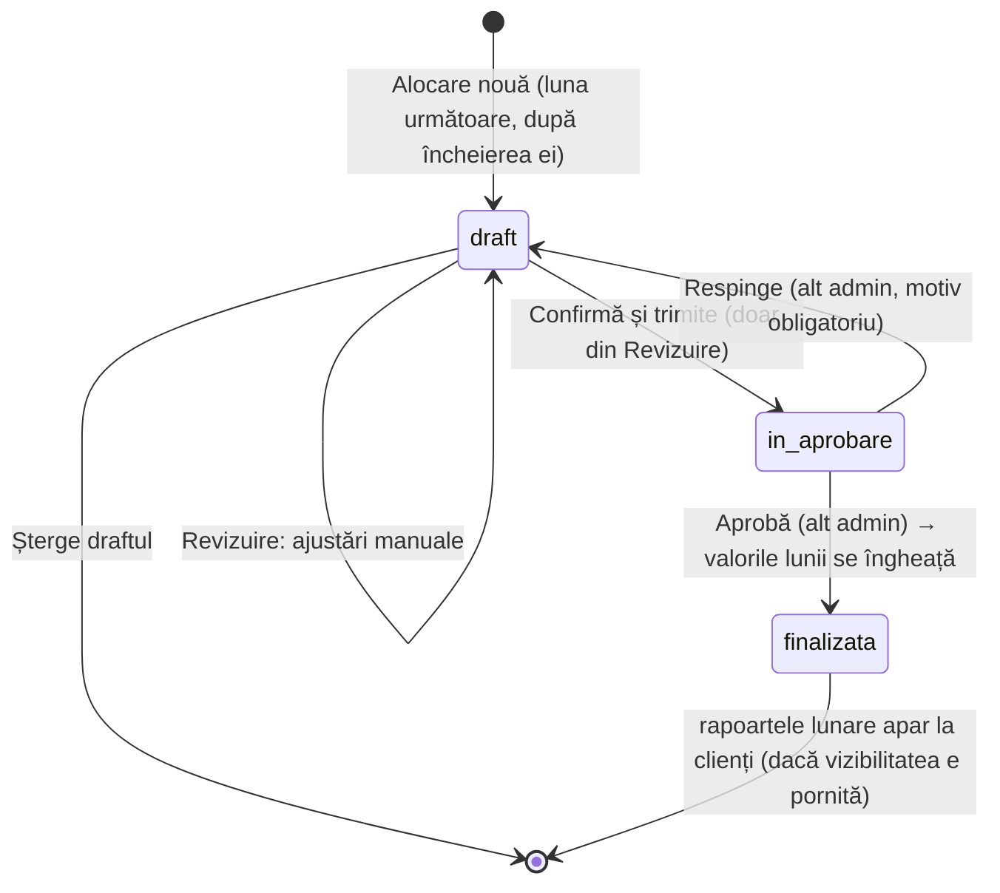

# Specificație de implementare · Modulul „Alocări DEEE”

**Platforma Alegreen (ALE GREEN UMB SRL) · versiunea 1.0 · 1 octombrie 2026**
**Destinatari:** programatorul platformei și agenții AI care lucrează pe codul ei.
**Sursa de adevăr:** prototipul din acest repository (o „specificație vie”) plus documentele din `docs/`.

---

## 0. Cum se citește acest document

Documentul descrie **ce trebuie construit în platforma reală** (app.alegreen.ro) pentru modulul de alocare DEEE, așa cum a fost validat de Alegreen în prototip. E scris normativ, în stilul briefului tehnic v1.0:

- **TREBUIE / NU TREBUIE**: cerință obligatorie. **AR TREBUI**: recomandare puternică. **POATE**: opțiune.
- Cerințele noi sau modificate față de brief au identificatorul **P-xx** (de la „prototip”). Cerințele din brief (RB, ALG, DAT, UI, AC, D) rămân valabile pentru tot ce nu e schimbat explicit aici.
- Fiecare regulă trimite la fișierul din prototip care o implementează. Când textul și codul par să difere, **codul și testele lui au prioritate**: au fost validate pe date reale.

### 0.1 Ordinea documentelor

| Prioritate | Document | Rol |
| --- | --- | --- |
| 1 | Acest document | Deciziile luate după brief și forma finală a fluxului |
| 2 | `src/engine/*` + testele `*.test.ts` | Implementarea de referință a calculului (executabilă) |
| 3 | `docs/Brief_Tehnic_Modul_Alocare_DEEE_Alegreen_v1.0.docx` | Brieful normativ (glosar, model de date, reguli, golden set) |
| 4 | `docs/Reguli_colectare_alocare_DEEE.docx` | Metodologia, pe înțelesul oricui |
| 5 | `docs/raport_alocare_2167.xlsx` | Implementarea în Excel; sursa setului golden |
| 6 | `docs/modele-rapoarte/*.pdf` | Modelele rapoartelor lunare pentru clienți (altă platformă, de referință) |
| 7 | `docs/screenshots/` și `docs/prototip-faza*/` | Platforma actuală (01–05) și ecranele prototipului, pe etape |

### 0.2 Pentru agenți AI (citiți înainte de a scrie cod)

1. **Nu deduceți reguli de business** care nu apar aici sau în brief. Dacă lipsește o regulă, opriți-vă și întrebați.
2. **Deciziile din §12 (deschise) nu se implementează** fără confirmarea scrisă a Alegreen.
3. **Portați motorul ca funcție pură**, separat de UI și de baza de date (`allocate` → `applyAdjustments` → `monthlySession`). Testele golden din `src/engine/allocate.test.ts` TREBUIE să treacă în noua implementare **înainte** de orice lucru pe UI.
4. **Fără `float` în calcul.** Folosiți un tip zecimal (Prisma `Decimal` / `decimal.js`) sau grame întregi. Rotunjirea se face doar la afișare (vezi §5.4).
5. Orice verificare de permisiuni din §8 TREBUIE făcută **pe server**. În prototip există doar în UI.

---

## 1. Context, pe scurt

- Alegreen este **OIREP** pentru DEEE: preia de la producători și importatori (clienți) obligația legală de colectare și o îndeplinește în numele lor.
- **Clientul** raportează lunar cantitățile de EEE puse pe piață, pe categorie și subcategorie (există deja în platformă).
- **Adminul** introduce cantitățile de DEEE colectate efectiv, pe categorie și lună, și face **alocarea**: împarte colectatul pe categorii și pe clienți, ca fiecare client să știe cât din obligația lui a fost acoperită, cu ce și în ce lună.
- Clienții primesc **rapoarte lunare obligatorii pentru AFM** în contul lor și le depun mai departe. De aceea alocarea se face **lunar**, iar o lună odată raportată **nu se mai modifică** (§3).

### 1.1 Prototipul

| | |
| --- | --- |
| Stack | Vite + React 19 + TypeScript + Tailwind 4 + Recharts + lucide-react + decimal.js + Vitest |
| Pornire | `npm install && npm run dev` → http://localhost:5173 · teste: `npm test` (53 de teste) |
| Date | Reale, extrase din `docs/raport_alocare_2167.xlsx` (14 clienți, 136 linii de declarație, colectat iulie–august 2026) cu `npm run seed` |
| Persistență | Stare locală (`src/data/store.tsx`) salvată în `localStorage`. Stratul `src/data/` se înlocuiește cu API-ul real. |
| Roluri | Comutator „Prototip · perspectivă” (dreapta jos): doi admini (Andrei C, Ion Popescu) sau oricare client. ↺ resetează datele demo. |
| Link de test | `npm run build:artifact` produce varianta publicabilă (navigare în memorie, fără export/print). |

Platforma reală pare să fie Next.js + Prisma (URL-urile folosesc ID-uri cuid). Componentele prototipului nu depind de Vite și pot fi mutate ca atare. **Stack-ul real (D-07) trebuie confirmat de echipa de dezvoltare.**

---

## 2. Deciziile luate după brief (registru)

Toate deciziile de mai jos au fost **confirmate de Alegreen** în timpul validării prototipului (septembrie–octombrie 2026). Ele modifică sau completează brieful v1.0.

| ID | Decizie | Înlocuiește / completează | Implementare |
| --- | --- | --- | --- |
| P-01 | **Rata efectivă = 0,2167** (21,67%), nu 0,216667. Cu 0,216667, setul golden nu se reproduce (ex. obligația cat. 2 = 211,84 în loc de 211,87). | RB-03 | `src/data/store.tsx` (reguli implicite) |
| P-02 | **Regulile de alocare se editează și se salvează explicit** într-un tab separat („Reguli de alocare”), cu autorul și data ultimei modificări. Fiecare sesiune păstrează o **copie** a regulilor cu care a fost calculată. | UI-A2 (zona de parametri) | `RulesEditor.tsx`, `CategoryRulesTable.tsx` |
| P-03 | **Alocarea se face pe sesiuni lunare.** Sesiunea lunii M alocă colectatul **cumulat ianuarie–M**, iar alocarea lunii = cumulat − ce s-a raportat deja. Lunile aprobate sunt **înghețate**. | RB-11 (defalcarea lunară retroactivă), DAT-03, DAT-06 | `src/engine/monthly.ts` |
| P-04 | Dacă, la un client, cumulatul calculat iese **sub** ce i s-a raportat deja, luna primește **0** (niciodată negativ), se emite avertizarea **A-06**, iar sesiunea nu se poate trimite până la corectare (verificarea **R-4**). | nou | `monthly.ts` |
| P-05 | **Sesiunile merg strict în ordine**: se poate porni doar luna de după ultima sesiune aprobată, și doar după încheierea ei (luna M se alocă în M+1). | nou | `src/data/sessions.ts` → `nextDueMonth` |
| P-06 | **O singură sesiune deschisă pe an** (draft sau în aprobare). | nou | reducer `createRun` |
| P-07 | Fiecare sesiune are un **ID unic, lizibil**: `ALOC-AAAA-LL-NN` (NN = a câta sesiune pornită pentru acea lună; contorul nu scade, deci un ID nu se refolosește după ștergere sau respingere). | nou | `sessionCode()` în `sessions.ts` |
| P-08 | Sesiunea parcurge 4 pași: **Calcul automat → Revizuire și confirmare → Aprobare (alt admin) → Publicat la clienți**. Trimiterea spre aprobare se face **doar** din ecranul de Revizuire. | UI-A2 (finalizare) | `RunStepper.tsx`, `ReviewPage.tsx` |
| P-09 | **Ajustări manuale** la Revizuire: se pot muta cantități **doar între clienții aceleiași categorii**; totalul categoriei nu se schimbă. | RB-10 (strict proporțional) | `src/engine/adjustments.ts` |
| P-10 | La o mutare, lunile urmează **proporțional sursa**: retragerea preia proporția lunară a clientului; atribuirea preia proporția lunară a disponibilului. | nou | `adjustments.ts` |
| P-11 | Un client **nu poate depăși obligația lui** în categorie după o ajustare. | nou | `adjustments.ts` (R-2) |
| P-12 | Trimiterea spre aprobare cere **disponibilul de realocat = 0** (tot ce s-a retras e reatribuit) și **motiv obligatoriu** dacă există ajustări. | nou | `ReviewPage.tsx` (R-1) |
| P-13 | **Ajustările aprobate se reaplică în lunile următoare**, altfel o mutare manuală s-ar anula singură luna următoare. | nou | `src/data/useRunResult.ts` |
| P-14 | Aprobatorul (alt admin) poate **respinge** sesiunea cu **motiv obligatoriu**. Sesiunea revine în draft, la Revizuire, cu ajustările păstrate și motivul afișat operatorului. | UI-A2 | `RejectRunForm.tsx`, reducer `rejectRun` |
| P-15 | Din fiecare sesiune aprobată, clientul primește în cont **3 rapoarte lunare**: Situație EEE, Raport client – declarație AFM și Raportare EEE puse pe piață (§7). Termenul corect este **OIREP**. | UI-C1, EXP-02 | `src/components/reports/*` |
| P-16 | **Avertizarea A-02** se emite doar pentru categoriile cu obligație > 0 (altfel ar spune „Lipsesc 0,00 kg”). | §6.3 | `allocate.ts` |
| P-17 | Rotunjire: reziduul de rotunjire al **totalurilor** merge la clientul cu cota cea mai mare (§7 din brief). Lunile unui client se închid exact pe totalul lui (reziduul merge la luna cu alocarea cea mai mare). | §7, D-05 parțial | `src/engine/rounding.ts` |
| P-18 | „Maxim admis din alte categorii” = obligație × plafon de substituție (ca în pseudocodul §6.2 și în platforma actuală), nu minimul cu necesarul rămas (cum face Excel-ul). | DAT-04 | `allocate.ts` |
| P-19 | Clientul „Exemplu” (CUI 28736322) **rămâne inclus**, pentru că setul golden îl conține. Marcarea ca test este suportată (A-05, AC-10). | D-08 (rămâne deschisă) | `seed` |
| P-20 | Baza de calcul „media pe 3 ani anteriori” (formula legală) apare în interfață, dar **dezactivată** până la decizia D-01. Activă: declarațiile anului de obligație (tranziția 2026, ca în Excel). | RB-03, D-01 | `engineInput.ts` |

---

## 3. Fluxul unei sesiuni lunare (end-to-end)



| Pas | Cine | Ce se întâmplă | Condiții (TREBUIE verificate pe server) |
| --- | --- | --- | --- |
| 1. Alocare nouă | Admin | Se creează sesiunea `draft` pentru (an, lună), cu ID `ALOC-…`, copie a datelor (declarații aprobate, colectat, clienți), copie a regulilor salvate și contextul lunilor deja raportate. | luna = `nextDueMonth`; luna s-a încheiat; nicio altă sesiune deschisă pe an (P-05, P-06) |
| 2. Calcul automat | Sistem | Motorul calculează instant. UI-ul derulează rezultatul animat (M4). | — |
| 3. Revizuire și confirmare | Admin | Verifică datele, mută cantități între clienții aceleiași categorii, completează motivul, trimite spre aprobare. | invarianți OK; R-1…R-4 OK; motiv dacă există ajustări (P-12) |
| 4a. Aprobare | **Alt** admin decât cel care a calculat | Valorile lunii se îngheață (`raportLuna`) și devin rapoartele lunare + baza lunii următoare. | aprobator ≠ creator; aceleași verificări ca la 3 |
| 4b. Respingere | Alt admin | Revine în `draft` cu motivul afișat. Ajustările se păstrează. | motiv obligatoriu (P-14) |
| 5. Publicat | — | Clienții văd rapoartele lunii, doar dacă vizibilitatea modulului e pornită. | doar sesiuni `finalizata`; doar liniile clientului (UI-C2) |

Statusul `inlocuita` din DAT-03 **nu se mai folosește** pentru sesiunile lunare: o lună aprobată nu se înlocuiește. Corecția unei luni deja raportate către AFM nu e în scopul acestui update (vezi §12).

---

## 4. Model de date

Câmpurile de mai jos sunt cele din `src/data/types.ts`. Schema Prisma e **orientativă** (stack-ul real e de confirmat, D-07). Toate cantitățile: `Decimal(18,6)` în bază, afișare cu 2 zecimale.

### 4.1 Entități

| Entitate | Câmpuri esențiale | Note |
| --- | --- | --- |
| `CategorieDeee` (DAT-01) | `cod` (PK: 1, 2, 3, 4, 4B, 5, 6), `denumire`, `pragMinimPropriu`, `plafonSubstitutie`, `ordineAlocare`, `activ`, `folosestePragImplicit` | Cat. 1 există, inactivă. Implicit: 3 → 100/0; 4B → 0/100; restul → 30/70. |
| `ReguliAlocare` (P-02) | `rataEfectiva` (0,2167), `pragMinimImplicit` (0,3), categoriile (ca mai sus), `modificatLa`, `modificatDe` | Un singur set activ. AR TREBUI păstrat istoricul versiunilor (audit, D-06). |
| `Colectare` (DAT-02) | `an`, `luna`, `categorieCod`, `cantitateKg`, `observatii`, `creatDe`, timestamps | Unic pe (an, luna, categorie). Modificările → jurnal de audit. |
| `SesiuneAlocare` (DAT-03 + P-03) | `id` (cuid), `codSesiune` (unic, P-07), `anObligatie`, `luna`, `baza`, `rataEfectiva`, `pragMinimImplicit`, `reguli` (JSON, copie), `status` (`draft` · `in_aprobare` · `finalizata`), `creatDe/La`, `trimisSpreAprobareLa`, `revizuitDe`, `motivAjustari`, `aprobatDe`, `finalizatLa` | Sesiunea păstrează copia regulilor (P-02). Datele de intrare pot fi păstrate ca snapshot JSON (ca în prototip) sau reconstituite din tabelele versionate. |
| `ContorSesiune` (P-07) | cheie `AAAA-LL`, `ultimulNr` | Incrementat tranzacțional la crearea sesiunii. |
| `AjustareManuala` (P-09) | `sesiuneId`, `ordine`, `tip` (`retragere` · `atribuire`), `clientId`, `categorieCod`, `kg`, `autorId`, `la` | Jurnal ordonat. Se aplică în ordine (determinist). |
| `RespingereSesiune` (P-14) | `sesiuneId`, `deAdminId`, `la`, `motiv` | 0..n pe sesiune. |
| `AlocareClientLuna` (DAT-06, înghețat) | `sesiuneId`, `clientId`, `categorieCod`, `luna` (AAAA-LL), `kg` (2 zecimale) | Scris **o singură dată, la aprobare** (`raportLuna`). Sursa rapoartelor lunare și baza sesiunii următoare. Imutabil. |
| `Client` (existent) | + `adresa`, `regCom`, `nrProducator` (opțional, MOD-06), `esteTest` | Necesare în antetul rapoartelor lunare. |
| `SetareModul` | `vizibilitateClienti` (bool) | Bannerul „Vizibilitate pentru clienți”. |

### 4.2 Schemă Prisma (orientativă)

```prisma
enum StatusSesiune { draft in_aprobare finalizata }
enum TipAjustare   { retragere atribuire }

model SesiuneAlocare {
  id                   String        @id @default(cuid())
  codSesiune           String        @unique            // ALOC-2026-09-01
  anObligatie          Int
  luna                 Int                               // 1–12, luna alocată și raportată
  baza                 String                            // "declaratii_an_curent" (D-01 deschisă)
  rataEfectiva         Decimal       @db.Decimal(7, 6)
  pragMinimImplicit    Decimal       @db.Decimal(5, 4)
  reguli               Json                              // copia regulilor la creare
  status               StatusSesiune @default(draft)
  creatDeId            String
  creatLa              DateTime      @default(now())
  trimisSpreAprobareLa DateTime?
  revizuitDeId         String?
  motivAjustari        String?
  aprobatDeId          String?
  finalizatLa          DateTime?
  ajustari             AjustareManuala[]
  respingeri           RespingereSesiune[]
  alocariLuna          AlocareClientLuna[]
  @@index([anObligatie, luna, status])
}

model AjustareManuala {
  id           String      @id @default(cuid())
  sesiuneId    String
  ordine       Int
  tip          TipAjustare
  clientId     String
  categorieCod String
  kg           Decimal     @db.Decimal(18, 6)
  autorId      String
  la           DateTime    @default(now())
  sesiune      SesiuneAlocare @relation(fields: [sesiuneId], references: [id])
  @@unique([sesiuneId, ordine])
}

model RespingereSesiune {
  id        String   @id @default(cuid())
  sesiuneId String
  deAdminId String
  la        DateTime @default(now())
  motiv     String
  sesiune   SesiuneAlocare @relation(fields: [sesiuneId], references: [id])
}

model AlocareClientLuna {                               // înghețat la aprobare
  sesiuneId    String
  clientId     String
  categorieCod String
  luna         String                                   // "2026-09"
  kg           Decimal  @db.Decimal(18, 2)
  sesiune      SesiuneAlocare @relation(fields: [sesiuneId], references: [id])
  @@id([sesiuneId, clientId, categorieCod])
  @@index([clientId, luna])
}
```

Constrângeri care TREBUIE impuse în bază sau în tranzacția de server:

- cel mult o sesiune cu `status in (draft, in_aprobare)` pe `anObligatie` (P-06);
- cel mult o sesiune `finalizata` pe (`anObligatie`, `luna`);
- `AlocareClientLuna` se scrie doar la tranziția `in_aprobare → finalizata` și nu se mai modifică.

---

## 5. Calculul

Calculul are trei straturi pure, aplicate în ordine. Toate primesc și întorc structuri de date, fără efecte laterale (RB-14, idempotență).

```
rezultat = monthlySession(
             applyAdjustments(
               applyAdjustments(allocate(intrare), ajustariAprobateAnterior),   // P-13
               ajustariSesiuneCurenta),
             lunaCurenta,
             lunileDejaRaportate)
```

Vezi `src/data/useRunResult.ts` pentru compunerea exactă.

### 5.1 `allocate` — algoritmul anual (brief §6.2, neschimbat)

Fișier: `src/engine/allocate.ts`. Intrarea (`AllocationInput`, `src/engine/types.ts`): rata, categoriile cu reguli, clienții, liniile de declarație din baza de calcul, colectarea și lunile perioadei (ianuarie–M).

1. **Agregare:** declarat pe client × categorie (doar clienți non-test, declarat > 0, RB-13); colectat pe categorie × lună.
2. **Obligație** = declarat × rată; **minim propriu** = obligație × prag.
3. **Propriu:** utilizat = min(colectat, obligație); surplus = colectat − utilizat; necesar = obligație − utilizat. Dacă colectat < minim propriu → **A-01**.
4. **Pool** = suma surplusurilor tuturor categoriilor, constituit înainte de distribuire.
5. **Plafon** = obligație × plafon de substituție (P-18).
6. **Distribuire** în ordinea `ordineAlocare`: alocat din pool = min(necesar, plafon, pool disponibil). Dacă îndeplinire < 100% și obligație > 0 → **A-02** (P-16). Pool rămas > 0 → **A-03**.
7. **Clienți:** cotă = declarat client / declarat categorie; alocat = total categorie × cotă. Toți clienții unei categorii au același % (înainte de ajustări).
8. **Invarianți I-1…I-6** (§6).

### 5.2 `applyAdjustments` — ajustările de la Revizuire (P-09…P-13)

Fișier: `src/engine/adjustments.ts`.

- Fiecare categorie are un **disponibil de realocat** (buffer), inițial 0.
- `retragere(client, categorie, kg)`: kg ≤ alocatul clientului. Lunile clientului scad proporțional, iar bufferul crește cu aceleași luni.
- `atribuire(client, categorie, kg)`: kg ≤ buffer și alocat + kg ≤ obligația clientului (P-11). Lunile se iau proporțional din buffer.
- O ajustare invalidă e respinsă și raportată în `erori` (verificarea R-3).
- Se recalculează I-2 și I-5 (I-5 devine: suma clienților + buffer = total categorie).
- Verificările de revizuire: **R-1** buffer = 0 · **R-2** niciun client peste obligație · **R-3** toate ajustările valide.

### 5.3 `monthlySession` — sesiunea lunară (P-03, P-04)

Fișier: `src/engine/monthly.ts`.

Pentru fiecare client × categorie:

```
raportatAnterior = Σ kg înghețate în lunile < M (AlocareClientLuna)
cumulatCalculat  = totalul afișat (rotunjit, §5.4) după ajustări
luna M           = max(0, cumulatCalculat − raportatAnterior)        // 2 zecimale
dacă cumulatCalculat < raportatAnterior → A-06, R-4 eșuează
```

- „Alocat {lună}” pe categorie = suma lunilor clienților (valorile raportate).
- `raportLuna` = lista (client, categorie, luna M, kg) care se îngheață la aprobare.
- Pentru că toate valorile lunare au 2 zecimale, **suma rapoartelor lunare = cumulatul afișat**, exact.
- Din 2027, obligația e fixă de la începutul anului (media anilor anteriori), deci cumulatul nu poate scădea și A-06 nu apare. În tranziția 2026, baza crește cu fiecare declarație, iar A-06 e plasa de siguranță.

### 5.4 Precizie și rotunjire

- Calcul în zecimal cu 40 de cifre semnificative (`decimal.js`); persistență cu 6 zecimale; afișare cu 2 zecimale (half-up), format românesc `1.234,56` (`src/lib/format.ts`).
- **Totaluri pe clienți:** după rotunjire, diferența față de totalul rotunjit al categoriei se adaugă clientului cu cota cea mai mare (P-17).
- **Lunile unui client** se închid exact pe totalul lui afișat; reziduul merge la luna cu alocarea cea mai mare.
- Consecință acceptată: suma lunilor unui client poate diferi cu 0,01 kg de valoarea golden (ex. Elbi, cat. 5: 61.830,32 față de 61.830,31), în toleranța de 0,01 kg din brief.

---

## 6. Avertizări, invarianți și verificări

| Cod | Tip | Condiție | Efect |
| --- | --- | --- | --- |
| A-01 | avertizare | colectat propriu < minim propriu | informativ |
| A-02 | avertizare | îndeplinire < 100% și obligație > 0 | informativ |
| A-03 | avertizare | pool rămas > 0 | informativ |
| A-04 | avertizare | linii cu bucăți > 0 și greutate 0 | informativ (VAL-01 le va bloca la sursă) |
| A-05 | avertizare | există clienți `esteTest` | informativ |
| **A-06** | avertizare (nou) | cumulat client < raportat anterior | luna = 0; blochează prin R-4 |
| I-1…I-6 | invariant | brief RB-12 (I-2 și I-5 recalculate după ajustări) | blochează trimiterea și aprobarea |
| **R-1** | verificare revizuire | disponibil de realocat = 0 | blochează trimiterea |
| **R-2** | verificare revizuire | niciun client peste obligație | blochează |
| **R-3** | verificare revizuire | toate ajustările valide | blochează |
| **R-4** | verificare revizuire | niciun cumulat sub raportat (A-06) | blochează |

Textele exacte ale mesajelor sunt în `allocate.ts`, `adjustments.ts` și `monthly.ts` și TREBUIE păstrate identic.

---

## 7. Rapoartele lunare ale clientului (P-15)

Se generează **doar din sesiuni aprobate**, pentru clientul autentificat, din valorile **înghețate** (`AlocareClientLuna`) și din declarațiile lui. Modelele (altă platformă) sunt în `docs/modele-rapoarte/`. Implementarea: `src/components/reports/`.

Categoriile apar mereu toate, în ordinea formularului AFM: 1, 2, 3, 4, 4B, 5, 6 (`REPORT_CATEGORIES` în `reportData.ts`).

### 7.1 Situație EEE (`SituatieEEEReport.tsx`)

Antet: Client, Adresa, CUI, Reg. com., Nr. / luna (`ALOC-… / LL.AAAA`), Data generării, Categorii declarate.

| Coloană | Sursă |
| --- | --- |
| Cantități de EEE puse pe piață în luna M (kg) | Σ greutate din declarațiile aprobate ale clientului, luna M, categoria |
| Cantitate colectată de DEEE aferentă lunii M* (kg) | `AlocareClientLuna` pentru luna M |
| Cantitate de EEE pusă pe piață aferentă ianuarie – M (kg) | Σ declarații ianuarie–M |
| Cantitate colectată de DEEE aferentă ianuarie – M (kg) | Σ `AlocareClientLuna` ianuarie–M |

Rând TOTAL. Notă de subsol obligatorie despre repartizarea proporțională (UI-C1).

### 7.2 Raport client – declarație AFM (`RaportAFMReport.tsx`)

Antet: Client, CUI, Reg. com., Nr. înregistrare producător, Luna raportare, ID sesiune alocare.

| Coloană | Valoare |
| --- | --- |
| Cantitate totală de EEE introdusă pe piața națională (kg) | declarat în luna M |
| … realizează obiectivele în mod individual (kg) | 0 |
| … realizează obiectivele prin transfer către OIREP (kg) | = cantitatea totală introdusă |
| Cantitate de DEEE colectată în mod individual (kg) | 0 |
| Cantitate de DEEE colectată de către OIREP (kg) | `AlocareClientLuna` pentru luna M |

### 7.3 Raportare EEE puse pe piață (`RaportareEEEReport.tsx`)

Declarația lunară a clientului: sumar pe categorie (bucăți, greutate) și liniile pe subcategorie (categorie, subcategorie, denumire, cantitate, greutate, valoare fără TVA), cu total general. Liniile cu bucăți > 0 și greutate 0 sunt evidențiate.

În platforma reală, aceste documente TREBUIE generate și ca **PDF descărcabil** (EXP-02, EXP-05). În prototip, „Descarcă PDF” folosește printarea browserului.

---

## 8. Cerințe de server (prototipul le face doar în UI)

| ID | Cerință |
| --- | --- |
| P-30 | Toate tranzițiile de status (§3) se validează pe server, în tranzacție, inclusiv P-05, P-06, aprobator ≠ creator, motivele obligatorii. |
| P-31 | La aprobare, motorul **se rulează din nou pe server** pe datele sesiunii, iar `AlocareClientLuna` se scrie din acest rezultat (nu din ce trimite browserul). |
| P-32 | Un client vede doar sesiuni `finalizata`, doar liniile proprii, doar dacă vizibilitatea modulului e pornită — inclusiv prin URL direct sau API (UI-C2, AC-08). |
| P-33 | Jurnal de audit (DAT-08) pentru: salvarea regulilor, modificarea cantităților colectate, crearea, trimiterea, ajustările, respingerea, aprobarea și ștergerea sesiunilor. |
| P-34 | `codSesiune` se generează pe server, tranzacțional, din `ContorSesiune` (fără coliziuni la utilizatori concurenți). |
| P-35 | Ajustările se validează pe server cu aceleași reguli ca `applyAdjustments`; UI-ul poate doar să le propună. |
| P-36 | Notificare email la aprobare (NOT-08): „Situația alocării DEEE pentru {luna} {an} este disponibilă în contul dumneavoastră.” Doar dacă vizibilitatea e pornită. |

---

## 9. Interfața

### 9.1 Admin · `/admin/alocari` (`src/pages/admin/AllocationsPage.tsx`)

Sus: titlu și bannerul **Vizibilitate pentru clienți** (`VisibilityBanner`). Cardul principal are 3 tab-uri (`AllocationTabs`):

**Tab „Alocări”** (implicit)
- `AvailabilitySection`: 4 KPI (obligație totală, colectat disponibil, alocat în ultima sesiune, îndeplinire globală), **donut** (`AvailabilityDonut`) cu colectatul pe categorii (inelul exterior) și alocat vs. încă disponibil (inelul interior, totalul colectat în centru), plus **legenda ca listă de categorii** (`CategoryLegend`): iconiță, cod, nume, kg, % din total, obligație, mini-bară obligație vs. colectat propriu cu marcaj la minimul propriu și semnalare A-01; categoriile inactive estompate.
- Sub grafic, `NewAllocationSection`: casetă restrânsă (anul, perioada graficului, următoarea lună de alocat, ID-ul următoarei sesiuni, butonul „Alocare nouă”). La clic, **caseta se extinde animat** (înălțime, umbră, fundal; ~500 ms, fără animație cu `prefers-reduced-motion`) în panoul complet (`NewAllocationPanel`): anul, luna (blocată pe următoarea lună de alocat), baza de calcul, regulile active read-only cu link „Modifică în Reguli de alocare”, avertizare dacă există o sesiune deschisă („Continuă sesiunea” / „Renunță la ea”).
- După pornire apare sesiunea (`RunWorkspace`), cu ID-ul ei.

**Tab „Reguli de alocare”** (`RulesEditor` + `CategoryRulesTable`): rata efectivă (cu explicația „65% ÷ 3 ani de referință = 21,67%”), pragul minim implicit, tabelul categoriilor (minim propriu %, maxim din alte categorii %, activă), ordinea pool-ului cu săgeți, „Salvează regulile” / „Renunță la modificări”, autorul și data ultimei salvări, punct pe tab când există modificări nesalvate.

**Tab „Istoric rulări”** (`RunHistoryTable`): ID sesiune (cu copiere), luna alocată, rată, obligație, alocat în lună, cumulat, % cumulat, status (Draft · În aprobare · Finalizată; „respinsă · de revizuit” după o respingere), data și autorul, „Deschide”.

### 9.2 Sesiunea (`RunWorkspace`, folosit inline și pe `/admin/alocari/:id`)

- `RunStepper` (cei 4 pași), KPI (obligație, alocat în luna M, cumulat ianuarie–M, clienți).
- **Alocare „live”** (`PlaybackBar`, `useAllocationPlayback`, `allocationTimeline.ts`): lunile anterioare apar direct ca încheiate (valori înghețate); luna curentă se derulează categorie cu categorie, întâi colectatul propriu, apoi pool-ul în ordinea configurată. Cifrele cresc live, iar totalurile și KPI-urile se actualizează sincron. Controale: Pauză / Continuă / Sari la final / Redă alocarea, viteză 0,5×–4×. Cu `prefers-reduced-motion` se afișează direct rezultatul. Animația e doar vizuală, derivată din rezultatul final; nu recalculează nimic.
- Tab „Rezultat pe clienți” (`ClientAllocationTable`): toți clienții care au declarat, rând = client × categorie, ordonați descrescător după declarat; comutator „Grupează pe categorii” cu subtotaluri; filtre: client/CUI, categorie, lună. Pe fiecare rând, **o singură bară a obligației anuale** (`AnnualProgressBar`), segmentată pe luni (tooltip: „Iulie 2026: X kg · Y% din obligația anuală”); albastră în timpul alocării, la final verde la 100% sau ambră sub 100%. Celulele lunare (`MonthProgressCell`) arată cifra; o lună fără alocări afișează „—”.
- Tab „Rezultat pe categorii” (`CategoryResultTable`): reproduce foaia „Alocare colectat”, cu coloanele de alocare animate; sub tabel, cele 3 verificări de reconciliere.
- `WarningsPanel` (avertizări și invarianți) și `FinalizationCard`: buton mare **„Revizuiește și confirmă →”** (activ după alocarea automată); la aprobator, jurnalul ajustărilor, motivul, „Aprobă și publică rapoartele pentru {luna}” și „Respinge” (cu motiv).

### 9.3 Revizuire și confirmare · `/admin/alocari/:id/revizuire` (`ReviewPage.tsx`)

- KPI: obligație, alocat în luna M (live), **disponibil de realocat** (live, ambră dacă > 0), numărul de ajustări.
- `ReallocationPanel`: pe fiecare categorie, alocat categoriei, atribuit clienților și disponibil de realocat (live).
- `ReviewClientTable`: grupat pe categorii; coloane: declarat, obligație, raportat în lunile anterioare (înghețat), luna M calculat automat, ajustare (±), **luna M final (editabil)** + „Max”, cumulat, capacitate rămasă, bara anuală, lunile. Scăderea valorii retrage diferența în disponibil; creșterea o ia din disponibil, fără a depăși obligația. Mesaje de validare inline.
- `AdjustmentLog` (jurnal: cine, când, cât, de la / către cine), „Anulează ultima ajustare”, „Revino la calculul automat”, verificările R-1…R-4, avertizările, motivul ajustărilor și **„Confirmă și trimite spre aprobare”** (cu motivele blocajului, dacă există).
- Banner roșu cu ultima respingere (`LastRejection`).

### 9.4 Admin · Cantități colectate · `/admin/cantitati-colectate`

Grilă categorii × luni, editabilă, cu totaluri și indicatorul „Există modificări neincluse în alocarea curentă”. În prototip e simplificată: fără audit, observații pe celulă și import CSV (UI-A1 rămâne valabil integral).

### 9.5 Client · `/client/alocari`, `/client/rapoarte`, `/client/rapoarte/:id/:tip`

- Sumar (an, declarat, obligație anuală, total alocat, îndeplinire), **Rapoarte lunare** (`MonthlyReportsList`: luna, colectat alocat în lună, cumulat, data publicării, cele 3 documente), evoluția cumulată pe luni (tabel + grafic), alocarea pe categorii cu bară de progres și extindere pe luni, nota de subsol obligatorie.
- Vizibilitate oprită: „Alocările EEE vor începe din luna Ianuarie 2026”. Fără sesiune aprobată: „Alocarea pentru {an} nu a fost încă publicată.”

### 9.6 Identitate vizuală

- Replica platformei actuale (capturile 01–05): sidebar închis la culoare, Noto Sans, text integral în română cu diacritice, numere `1.234,56`.
- **Culorile categoriilor sunt fixe** în toată aplicația (`src/lib/categoryStyle.ts`), validate pentru daltoniști: 2 `#2a78d6` (Monitor) · 3 `#eb6834` (Lightbulb) · 4 `#1baf7a` (WashingMachine) · 5 `#eda100` (Microwave) · 6 `#e87ba4` (Smartphone) · 4B `#008300` (SolarPanel) · 1 `#4a3aa7` (Thermometer). Categoriile apar mereu și cu cod + nume (unele culori au contrast < 3:1 pe alb).
- Confirmările se fac cu dialogul propriu (`ConfirmDialog`), nu cu `window.confirm`.

---

## 10. Teste de acceptanță

Testele din prototip TREBUIE portate în platformă și TREBUIE să treacă:

| Fișier | Ce verifică |
| --- | --- |
| `src/engine/allocate.test.ts` | Setul golden din brief §14.1–14.4 (toleranță 0,01 kg), AC-02, AC-03, AC-04, AC-05, AC-09, AC-10, A-04, rotunjirea, foaia „Exemplu regulă” (100 kg) |
| `src/engine/adjustments.test.ts` | Mutări în aceeași categorie, buffer, proporția lunară, plafonul la obligație, ajustări invalide |
| `src/engine/monthly.test.ts` | Seed ianuarie–august: iulie + august = cumulatul golden pe client; lunile raportate nu se schimbă; septembrie fără colectat = 0; A-06 și R-4 |
| `src/lib/allocationTimeline.test.ts` | Ordinea animației (propriu, apoi pool) și închiderea exactă pe rezultat |

Valori de control (sesiunile ianuarie–august 2026 pe datele din Excel):

| Verificare | Valoare |
| --- | --- |
| Obligație totală | 3.903.633,82 kg |
| Total alocat (cumulat august) | 3.881.910,00 kg · 99,44% |
| Alocat în iulie / august | 3.331.380,00 / 550.530,00 kg |
| Cat. 2 · NOVO BRANDS | 188,31 kg · 88,88% (A-01: blocată de minimul propriu) |
| Cat. 4B · ECO SUN NICULESTI | 2.323.036,30 kg · 99,38% |
| Următoarea lună de alocat | Septembrie 2026 (`ALOC-2026-09-01`) |

Scenarii manuale (în prototip, cu comutatorul de rol):

1. Introduceți colectat pe septembrie (ex. 4B: 400.000 kg) → „Alocare nouă” → animația → „Revizuiește și confirmă”.
2. La 4B scădeți ECO SUN cu 1.000 kg, apoi „Max” la ATLANTIS → disponibilul revine la 0 → motiv → trimitere.
3. Ca Ion Popescu: respingeți cu motiv → sesiunea revine la Andrei, cu motivul afișat → retrimiteți → aprobați.
4. „Publică pentru clienți” → ca ATLANTIS R.PW: rapoartele lunii septembrie; suma lunilor = cumulatul.
5. Încercați „Alocare nouă” cu o sesiune deschisă → blocat, cu „Continuă sesiunea”.

---

## 11. Ce NU face prototipul (de implementat în platformă)

- Persistența reală, autentificarea, verificările de server (§8), jurnalul de audit (DAT-08).
- Exportul PDF real al rapoartelor lunare și al rulării (EXP-01, EXP-02, EXP-05). Exportul Excel al rulării există (`src/lib/exportRun.ts`) ca model de structură.
- Importul CSV, observațiile pe celulă și auditul la „Cantități colectate” (UI-A1).
- Notificările email (NOT-08 și celelalte din §13 al briefului).
- Câmpurile din antetul rapoartelor care lipsesc din Excel: adresa, Reg. com., Nr. înregistrare producător (în prototip „—”; în platformă, din profilul clientului), „Data raportare” (data depunerii declarației; în prototip se afișează data generării), „Cantitate import”, „Tarif”, „Tip”, „Sursa”.
- Pachetele B–G din brief (termen de raportare, validări VAL-xx, notificări, MOD-xx), în afara modulului de alocare.

---

## 12. Decizii deschise (NU se implementează pe presupunere)

| ID | Problemă |
| --- | --- |
| D-01 | Baza obligației: declarațiile anului curent (Excel, activ acum) sau media Y-1…Y-3 (formula legală). Decide comportamentul din 2027. |
| D-02, D-03, D-04, D-09, D-10, D-11 | Din brief §15, neatinse de prototip. |
| D-05 | Parțial decisă (P-17). Rămâne de confirmat dacă regula „cota cea mai mare” e cea finală pentru audit. |
| D-06 | Cine poate modifica regulile de alocare (orice admin sau un rol dedicat). Prototipul permite oricărui admin și reține autorul. |
| D-07 | Stack-ul platformei (de confirmat de echipa de dezvoltare). |
| D-08 | Clientul „Exemplu”: rămâne inclus până la decizie (P-19). |
| P-D1 | Corectarea unei luni deja aprobate și raportate către AFM (în afara scopului acum: lunile aprobate sunt imutabile). |
| P-D2 | Dacă adminii trebuie să poată deschide rapoartele lunare ale unui client din profilul lui (UI-A4, „pentru suport telefonic”). |

---

## 13. Hartă rapidă a codului

```
src/engine/            calculul (pur, fără UI) ─ allocate · adjustments · monthly · rounding · months · types
src/data/              stratul de date de înlocuit cu API-ul ─ types · store (acțiuni) · sessions · engineInput · preview · useRunResult · seed/
src/lib/               formatare RO, etichete, culori pe categorie, cronologia animației, export Excel
src/hooks/             useAllocationPlayback (animația)
src/components/        allocation/ (admin) · reports/ (rapoarte lunare) · client/ · ui/ · layout/
src/pages/             admin/ (AllocationsPage, AllocationRunPage, ReviewPage, CollectedPage) · client/ (Alocări EEE, Rapoarte)
scripts/               extract_excel.py (seed) · screenshots*.mjs (capturi Playwright) · artifact-entry.html
docs/                  brief, reguli, Excel, modele de rapoarte, capturi
```

Acțiunile din `src/data/store.tsx` corespund 1:1 viitoarelor endpoint-uri: `createRun`, `addAdjustments`, `undoAdjustment`, `clearAdjustments`, `submitRun`, `rejectRun`, `approveRun`, `deleteDraft`, `saveRules`, `setCollected`, `setVisibility`.
